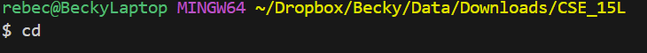
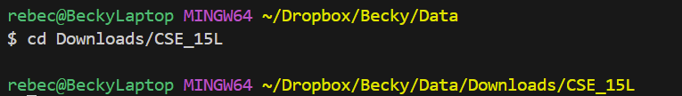
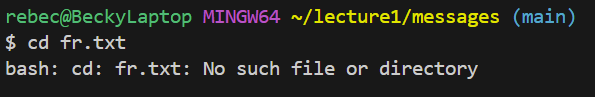
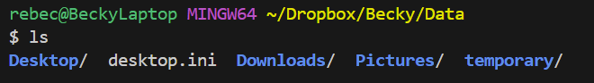
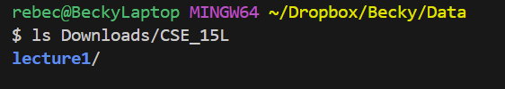
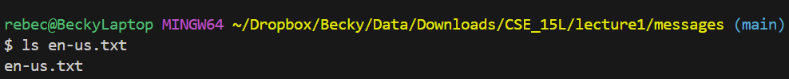
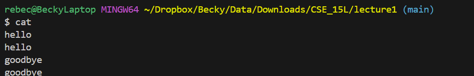
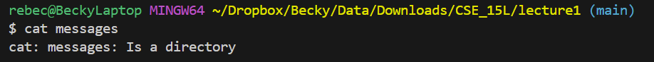
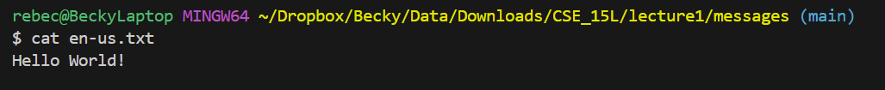

# Lab Report 1 - 04/02/24
---
```cd``` : *change directory*
---
#### **Share an example of using the command with no arguments.**
	\
Absolute path: ```/c/Users/rebec/Dropbox/Becky/Data/Downloads/CSE_15L```\
Nothing is printed and there is no change in the directory as there is no argument set.\
*No error* 
#### **Share an example of using the command with a path to a directory as an argument.**
	\
Absolute path: ```/c/Users/rebec/Dropbox/Becky/Data``` \
Nothing is printed and the directory is changed to the folder ```CSE_15L``` as the argument stated.\
*No error*
#### **Share an example of using the command with a path to a file as an argument.**
	\
Absolute path: ```/c/Users/rebec/Dropbox/Becky/Data/Downloads/CSE_15L/lecture1/messages```\
An error was printed, and the directory was *not* changed. \
**_Error:_**```Not a directory``` The argument in ```cd``` should be a file path, not a file. 


```ls``` : *list*
---
#### **Share an example of using the command with no arguments.**\
	\
Absolute path: ```/c/Users/rebec/Dropbox/Becky/Data```\
The list of contents of  ```Data``` (which is the current directory in the absolute path) are printed.\
*No error*

#### **Share an example of using the command with a path to a directory as an argument.**
	\
Absolute path: ```/c/Users/rebec/Dropbox/Becky/Data```\
The list of contents in  ```CSE_15L``` are printed. \
*No error*
#### **Share an example of using the command with a path to a file as an argument.**
	\
Absolute path: ```/c/Users/rebec/Dropbox/Becky/Data/Downloads/CSE_15L/lecture1/messages```\
The text file name is listed. \
*No error*


```cat``` : *concatenate*
---
#### **Share an example of using the command with no arguments.**
	\
Absolute path: ```/c/Users/rebec/Dropbox/Becky/Data/Downloads/CSE_15L/lecture1```\
Nothing is printed ```cat``` is expecting user input. Upon user input, the same text becomes the output.\
**_Error:_** While there is no explicit error printed, the output can be interpreted as an *infinite loop*, as there is no way for the code to stop itself.

#### **Share an example of using the command with a path to a directory as an argument.**
	\
Absolute path: ```/c/Users/rebec/Dropbox/Becky/Data/Downloads/CSE_15L/lecture1```\
The function checks if the given argument is a directory, and prints the output as follows. \
*No error*


#### **Share an example of using the command with a path to a file as an argument.**
	\
Absolute path: ```/c/Users/rebec/Dropbox/Becky/Data/Downloads/CSE_15L/lecture1/messages```\
The ```cat``` command prints the contents inside of the file specified in the argument.\
*No error*
