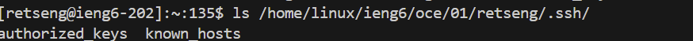

# Lab Report 2 - 04/16/24
## Part 1
### Code
```
import java.io.IOException;
import java.net.URI;
import java.util.*;

class Handler implements URLHandler {
    // The one bit of state on the server: a number that will be manipulated by
    // various requests.
    int num = 0;
    ArrayList<String> array = new ArrayList<String>();

    public String handleRequest(URI url) {
        String[] parameters = url.getQuery().split("=");
        if (url.getQuery().contains("s=") && url.getQuery().contains("user=")) {
            String str = parameters[1];
            int end = str.indexOf("&");
            String message = str.substring(0, end);
            String text = parameters[2] + ":" + message;
            array.add(text);
            String fullText = "";
            for(int i = 0; i<array.size(); i++){
                fullText += array.get(i);
                fullText += "\n";
            }
            return fullText;
         } else{
            return "404 Not Found!";
         }
    }
}

class ChatServer {
    public static void main(String[] args) throws IOException {
        if(args.length == 0){
            System.out.println("Missing port number! Try any number between 1024 to 49151");
            return;
        }

        int port = Integer.parseInt(args[0]);

        Server.start(port, new Handler());
    }
}
```

### Example Output

The main method and handleRequest methods are called. The argument for main is the input in the command line, while the argument for handleRequest is the url. The main method ensures that there is a port that can be tunneled to. The handleRequest method first splits up the input by the delimiter "=". It then takes the query and concatenates the user with the message. The string formed is put into an ArrayList and then a larger String is created and printed for iteration, which is what is returned.

The main method and handleRequest methods are called. The argument for main is the input in the command line, while the argument for handleRequest is the url. The main method ensures that there is a port that can be tunneled to. The handleRequest method first splits up the input by the delimiter "=". It then takes the query and concatenates the user with the message. The intermediate values indicating the message and user change for each iteration. The string formed is put into an ArrayList and then a larger String is created and printed for iteration, which is what is returned. The ArrayList in this screen shot is different and longer because it has stored the values of the previous iteration.

## Part 2

Indicates the absolute path to the private key in ```ieng6``` in VS Code.

Indicates the absolute path to the private key in ```ieng6``` on the server.


Logging into ```ieng6``` without being asked for a password
## Part 3
It was really interesting learning about sopying the ID, that allows for your computer to log into the server without using a password by utilizing keys in your computer. In my lab work, when I log into the server, I am tired of typing in the password each time. This can save me a lot of time!
