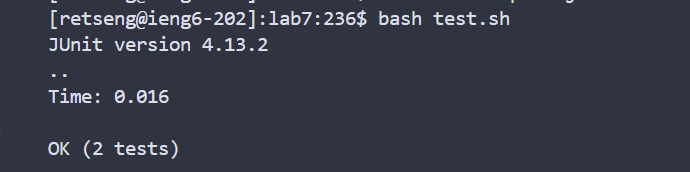

# Lab Report 2 - 04/16/24

```<up><up><up><up><up><enter>```

```<up><up><up><up><up><up><up><enter>```

```bash test.sh <enter>```

```vim ListExamples.java <enter>```
```43x<j><h><h><h><h><h><h><i><1><delete><:wq!><enter>```

```<up><up><enter>```

```git add .<enter>```
```git commit -m "committing changes" <enter>```

```git push origin main <enter>```
```<password>```
