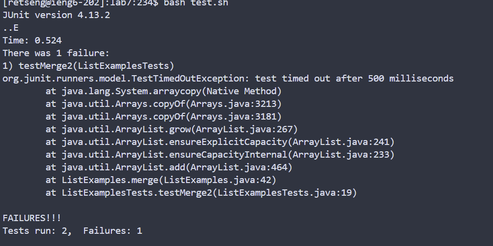

# Lab Report 7 - 05/14/24
 \
```<up><up><up><up><up><enter>``` \
I'm using the bash history to log into ieng6 \
 \
```<up><up><up><up><up><up><up><enter>``` \
I'm cloning the url from github into ```ssh``` by also using the bash history ```<up>``` key \
 \
```bash test.sh <enter>``` \
I am compiling and running the tests by running the ```test.sh``` file.
 \
```vim ListExamples.java <enter>``` \
First, I open the vim text editor. \
```<shift-g><k><k><k><k><k><k><2w><h><h><i><1><delete><esc><:wq!><enter>```
Then I use a short-cut ```<shift-g>``` to navigate to the end of the file,since I know the part I want to change is at the end of the file. Then I navigate to the desired word by using  ```<k>``` to move up, and ```<2w>``` to get to the second word (or rather, string separated by a space). After getting to the correct index I want to change, I press ```i``` to insert a 1 and delete the 2. Then to quit edit mode I hit ```esc``` and type in ```<:wq!> ``` to save and write the file.
 \
```<up><up><enter>``` \
I use bash history to run the tests again. All the tests pass \
 \
```git add .<enter>``` \
```git commit -m "committing changes" <enter>```
 \
```git push origin main <enter>``` \
```<password>``` \
I commit changes and push the changes into my Github account.
