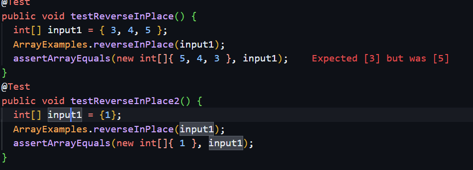
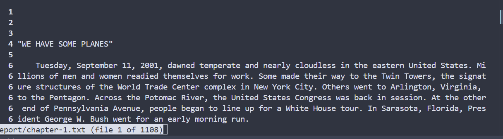
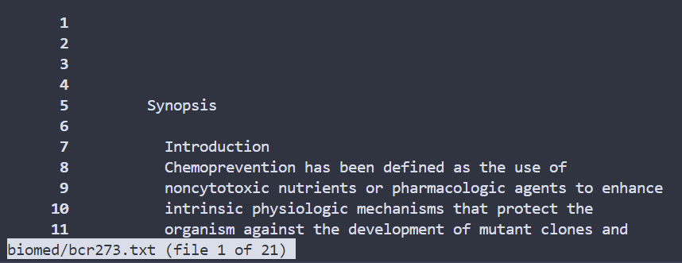
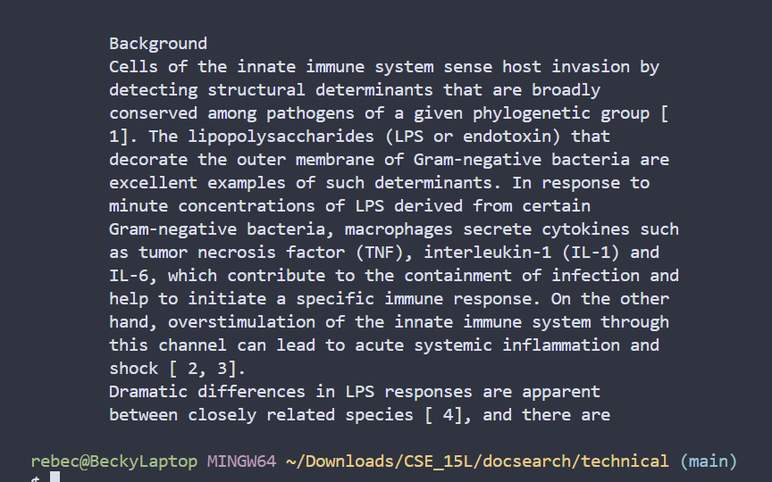
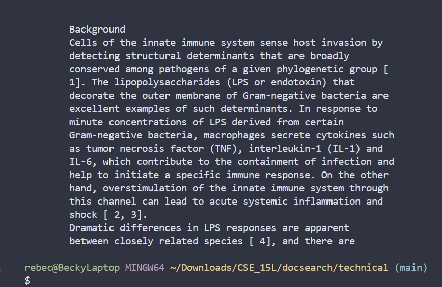
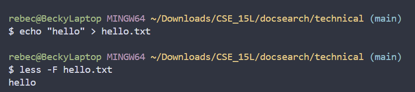
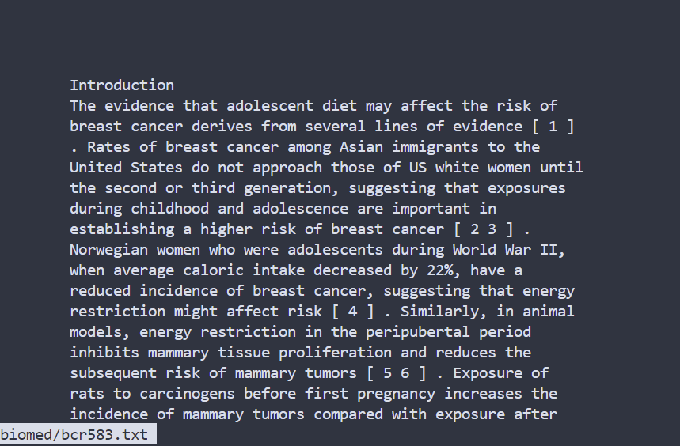
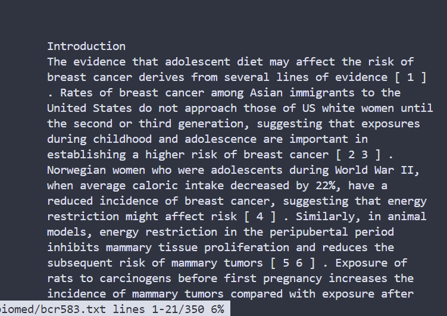
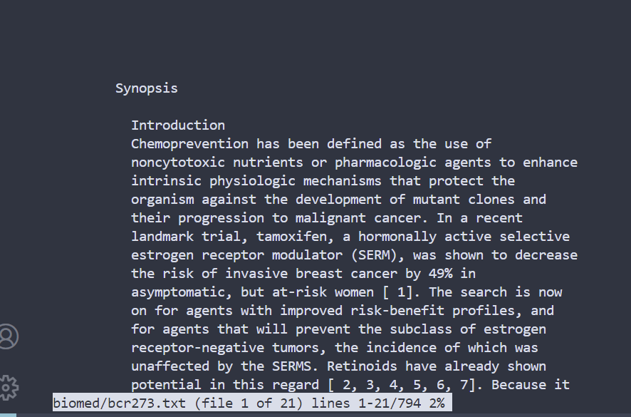
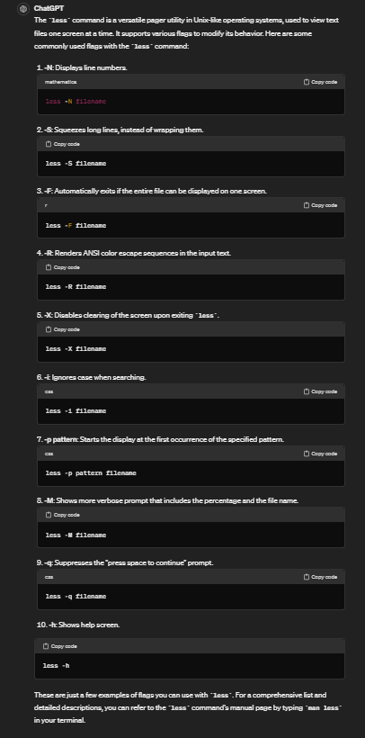

# Lab Report 3 - 04/30/24
## Part 1
### i.
```reverseInPlace``` method original:
```
  static void reverseInPlace(int[] arr) {
    for(int i = 0; i < arr.length; i += 1) {
      arr[i] = arr[arr.length - i - 1];
    }
  }

```
JUnit test fails:
```
	@Test 
	public void testReverseInPlace() {
    int[] input1 = { 3, 4, 5 };
    ArrayExamples.reverseInPlace(input1);
    assertArrayEquals(new int[]{ 5, 4, 3 }, input1);
	}
```
### ii.
JUnit test passes:
```
  @Test 
	public void testReverseInPlace2() {
    int[] input1 = {1};
    ArrayExamples.reverseInPlace(input1);
    assertArrayEquals(new int[]{ 1 }, input1);
	}
```
### iii.
Symptom:


### iv.
The bug:
Before: :x:
```
  static void reverseInPlace(int[] arr) {
    for(int i = 0; i < arr.length; i += 1) {
      arr[i] = arr[arr.length - i - 1];
    }
  }

```
After: :white_check_mark:
```
static void reverseInPlace(int[] arr) {
    int[] tmp = new int[arr.length];
    for(int i = 0; i<arr.length; i++){
      tmp[i] = arr[i];
    }
    for(int i = 0; i < arr.length; i += 1) {
      arr[i] = tmp[arr.length - i-1];
    }
  }
```
### v.
This fix helps address the problem by first creatng a temporary array, and then copying the elements in reverse-order. The original code is not sufficient and produces symptoms because the elements keep getting changed. For example, the first element is assigned to the last element, but then the order is not actually reversed as the elements switch places back again. 

## Part 2
### -N
```$ less -N */*.txt```

Prints all ```.txt``` files and then prints less of the list, with numbered lines. \
```$ less -N */bcr***.txt```

Finds ```.txt``` file that starts with bcr and then prints less of it, with numbered lines.

### -X
```$ less -X */*gb*.txt```

Finds files containing ```gb``` and prints a reduced version of the contents, and then leaves it on the screen once exiting. \
```$ less -X */*research*.txt```

Finds files containing ```gb``` and prints a reduced version of the contents, and then leaves it on the screen once exiting.

### -F
```$ less -X */hello.txt```

Finds file with the name ```bcr583.txt``` and then prints the entire file. Since the entire file can be displayed on one screen, it exits. \
```$ less -X */*bcr583.txt```

Finds file with the name ```bcr583.txt``` and then prints the beginning of the file. Since the entire file CANNOT be displayed on one screen, it does not exit.

### -M
```$ less -M */*bcr583.txt```

Finds file with the name ```bcr583.txt``` and then prints the beginning of the file. The highlighted part is changed, and now shows the percentage of the file displayed on the screen, along with the file line numbers of the text shown. \
```$ less -X */*bcr**.txt```
 \
Finds the ```.txt``` files containing ```bcr``` and then prints the beginning of one file. It shows the percentage of the file shown on the screen and the file line numbers of the text shown.

### Attribution
Less Command in Linux https://linuxize.com/post/less-command-in-linux/ \

OpenAI. "ChatGPT - OpenAI's Language Model." ChatGPT, Version 2, OpenAI, 2024 https://openai.com/chatgpt \
Prompt: What are some flag usages with the command less? \
Output: \
 \
Modification: I took the examples mentioned (-M, -F), and created examples of my own with the files in ```docsearch```
