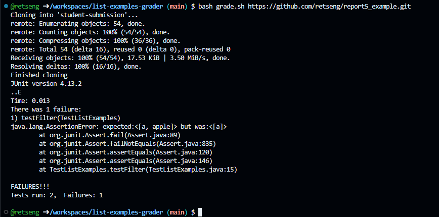
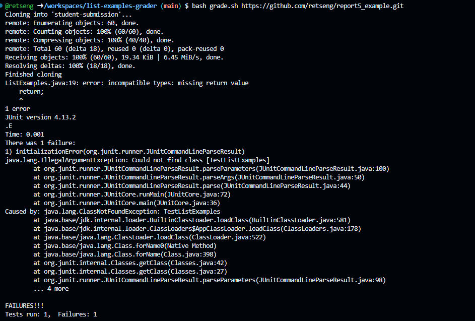
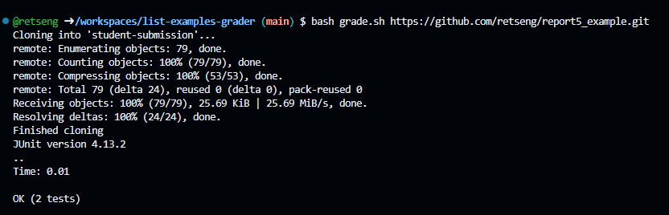

# Lab Report 7 - 05/14/24
## Part 1
### Student's Response
 \
Hi! I'm having some issues with getting my code to work correctly. It's not producing the expected output.
It's only printing one of the expected strings out of two. I'm guessing it has something to do with inserting 
an element in an ArrayList. Could I have someone look over my code?
### TA's Response
Hi, why don't you try breaking the code? I would look at your return statements and see what happens when
you don't return anything, or just put ```return```
### Troubleshooting
 \
It seems that the bug is that the student came under the assumption that there would only be one element in
the ArrayList that matches the StringChecker. As soon as I followed the TA's suggestion, I broke the code
and came across a compiler error. I made a mistake in declaring the new ArrayList in the conditional statement.
Instead, I should declare it before the loop, so that all of the elements get added to the same ArrayList,
and there will be multiple elements returned (if the ouput expects it).
### Conclusion
1. Directory and file-structure needed: The ```grade.sh``` file changes the directory to the folder ```grading-area```,
   and JUnit is copied and used to debug the file.
2. Contents of the file before fixing the bug:
   ```
   interface StringChecker { boolean checkString(String s); }
   class ListExamples {
   static List<String> filter(List<String> list, StringChecker sc) {
    for(String s: list) {
      if(sc.checkString(s)) {
        List<String> result = new ArrayList<>();
        result.add(s);
        return result;
      }
    }
   return list;
   }
   ```
3. Command Line: ```bash grade.sh https://github.com/retseng/report5_example.git```
4. To edit the bug, I declared the ArrayList before the ```for``` loop, and then changed the last return
      statement to return the ArrayList. I also edited the code such that the string matcher retrieves and
      adds the specific element of the iteration of the ArrayList. The fixed code can be found below:
         ```
         static List<String> filter(List<String> list, StringChecker sc) {
         List<String> result = new ArrayList<>();
         for(int i = 0; i<list.size(); i++) {
            if(sc.checkString(list.get(i))) {
              result.add(list.get(i));
            }
         }
         return result;
        }
 And the output:
 

## Reflection
I learned about how to use the Java Debugger (```jdb```) which was very practical for my work in future
coding classes. It was especially helpful to learn how to use this instead of using print statements,
which are more tedious and time-consuming. Using ```jdb``` can change how efficiently I change code.


   
